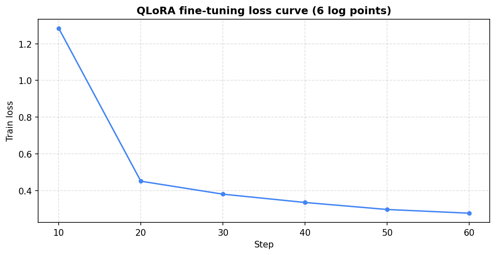
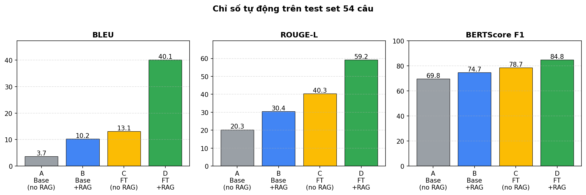
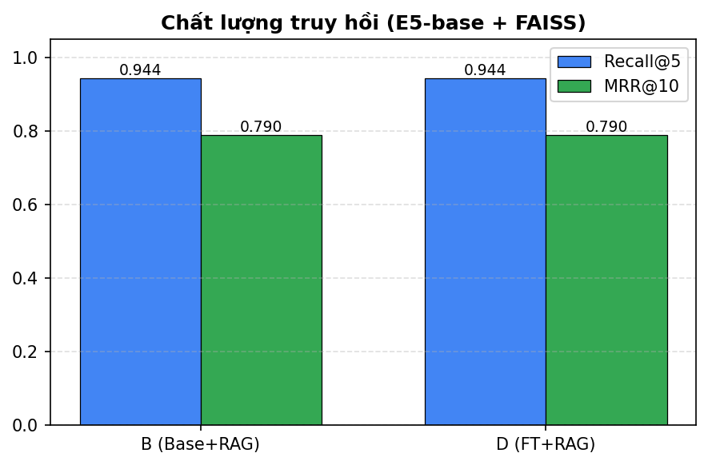
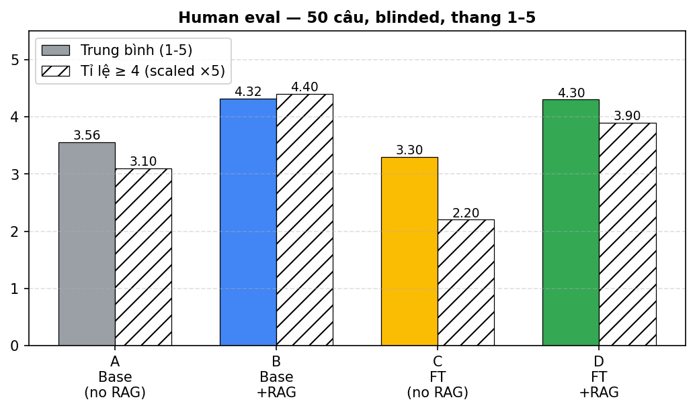

# Hệ thống hỏi đáp pháp luật thuế Việt Nam: kết hợp RAG và LLM fine-tuned

**Tác giả**: Phí Vương Tường Tâm
**Môn học**: Nhập môn Xử lý ngôn ngữ tự nhiên — Cuối kỳ
**Ngày**: <!-- TODO: điền ngày nộp -->
**Repo**: https://github.com/tamir39/rag-llm-vietnam-law-advisor
**Adapter**: https://huggingface.co/Tamir39/qwen2_5-7b-vietnam-tax-lora

---

## Tóm tắt (abstract)

<!-- 150–200 từ. Sau khi có kết quả mới viết. Cấu trúc gợi ý: bài toán → cách tiếp cận (RAG + QLoRA) → dữ liệu (5 luật thuế VN, 600 đoạn, 305+54 QA) → cấu hình so sánh A/B/C/D → kết quả nổi bật (BLEU/ROUGE-L/BERTScore/Recall@5 + human eval) → kết luận. -->

**Từ khóa**: Vietnamese NLP, RAG, QLoRA, Qwen2.5, multilingual-e5, FAISS, tax law QA.

---

## 1. Giới thiệu

### 1.1 Bài toán

- Người dân và doanh nghiệp Việt Nam thường gặp khó khăn khi tra cứu pháp luật thuế: văn bản dài, nhiều sửa đổi (VBHN), thuật ngữ chuyên ngành.
- Mục tiêu: xây hệ thống QA tiếng Việt, trả lời ngắn gọn, có **căn cứ pháp lý** (trích đoạn + URL gốc) cho 5 luật thuế: **GTGT**, **TNCN**, **đất phi nông nghiệp**, **TTĐB**, **TNDN**.

### 1.2 Đóng góp

1. Bộ KB 600 đoạn pháp lý có cấu trúc (Chương → Điều → Khoản → điểm) với URL Cổng Thông tin Chính phủ.
2. Bộ QA tiếng Việt 305 (train) + 54 (test) câu, có `passage_id` đối chiếu.
3. Pipeline RAG: `multilingual-e5-base` + FAISS top-k.
4. Adapter QLoRA cho `Qwen2.5-7B-Instruct`, đào tạo trên Kaggle, push lên HuggingFace.
5. Khung đánh giá ma trận A/B/C/D với 4 chỉ số tự động + human eval blinded 50 câu.

### 1.3 Cấu trúc báo cáo

Phần 2 mô tả KB và bộ QA. Phần 3 trình bày kiến trúc hệ thống. Phần 4 nói về fine-tuning. Phần 5 mô tả thiết kế đánh giá. Phần 6 trình bày kết quả. Phần 7 thảo luận, hạn chế và hướng phát triển.

---

## 2. Dữ liệu

### 2.1 Tri thức nền (KB)

| Trường        | Mô tả                                                       |
|---------------|-------------------------------------------------------------|
| `passage_id`  | `passage_000001` … `passage_000600` (đánh số liên tục)      |
| `doc_id`      | `doc_000001` … `doc_000005`                                 |
| `title`       | Tên văn bản                                                 |
| `passage_text`| Nội dung pháp lý                                            |
| `url`         | Liên kết Cổng Thông tin Chính phủ / vanban.chinhphu.vn      |

**Phân bố theo văn bản**:

| `doc_id`     | Văn bản                                                        | Số đoạn |
|--------------|----------------------------------------------------------------|--------:|
| `doc_000001` | VBHN 12/VBHN-VPQH 2026 — Luật Thuế GTGT                        |     143 |
| `doc_000002` | VBHN 103/VBHN-VPQH 2025 — Luật Thuế TNCN                       |     140 |
| `doc_000003` | Luật 48/2010/QH12 — Thuế sử dụng đất phi nông nghiệp           |      58 |
| `doc_000004` | Luật 66/2025/QH15 — Thuế tiêu thụ đặc biệt                     |     127 |
| `doc_000005` | Luật 67/2025/QH15 — Thuế thu nhập doanh nghiệp                 |     132 |
| **Tổng**     |                                                                | **600** |

Độ dài đoạn: min 86, trung bình 284, max 1752 ký tự — đủ ngắn để nhúng nguyên đoạn (không cần chunking).

### 2.2 Bộ QA

Định dạng JSONL:

```json
{"question": "...", "answer": "...", "passage_id": "passage_000XYZ"}
```

| Tập       | Số câu | Đặc điểm                                                  |
|-----------|-------:|-----------------------------------------------------------|
| `train_qa`|    305 | Phân bố theo loại: ~70 % fact, 15 % paraphrase, 10 % reasoning, 5 % tricky |
| `test_qa` |     54 | Khó hơn, không trùng nội dung câu hỏi với `train_qa`      |

Quy trình tạo: Claude sinh từng câu, **bám sát** đoạn KB, không kiến thức ngoài. Validator (`scripts/prepare_qa.py`) kiểm tra schema, tồn tại `passage_id`, trùng lặp, và overlap câu hỏi giữa train/test.

---

## 3. Kiến trúc hệ thống

```
                                 ┌──────────────────────┐
       câu hỏi VN ──────────────▶│  multilingual-e5-base│ (query: prefix)
                                 └──────────┬───────────┘
                                            │ vector 768-d (normalized)
                                            ▼
                              ┌──────────────────────────┐
                              │ FAISS IndexFlatIP (top-5)│
                              └──────────┬───────────────┘
                                         │ 5 đoạn KB + score
                                         ▼
                          ┌──────────────────────────────────────┐
                          │ prompt(SYSTEM_VI, ngữ cảnh, câu hỏi) │
                          └─────────────┬────────────────────────┘
                                        ▼
                       ┌──────────────────────────────────┐
                       │ Qwen2.5-7B-Instruct (4-bit nf4)  │
                       │ + LoRA adapter (cấu hình C/D)    │
                       └─────────────┬────────────────────┘
                                     ▼
                                trả lời + trích dẫn
```

### 3.1 Embedding & retrieval

- **Model**: `intfloat/multilingual-e5-base` (768-d).
- **Chiến lược prefix**: `query: ...` cho câu hỏi, `passage: ...` cho tài liệu — theo thiết kế gốc của E5.
- **Chuẩn hóa**: vector L2-norm = 1, FAISS dùng `IndexFlatIP` ⇒ tích vô hướng = cosine.
- **k**: 5.
- **Chunking**: passthrough (đoạn KB đã đủ ngắn).

### 3.2 Prompt template tiếng Việt

```
SYSTEM_VI: Bạn là trợ lý pháp luật chuyên về pháp luật thuế Việt Nam ...
USER (RAG):
  Ngữ cảnh tham khảo:
  [{passage_id}] {title}
  {passage_text}
  ...

  Câu hỏi: {question}
  Hãy trả lời dựa vào ngữ cảnh tham khảo. Nếu ngữ cảnh không đủ, hãy nói rõ.
ASSISTANT: ...
```

### 3.3 Sinh câu trả lời

- **Mô hình nền**: `Qwen/Qwen2.5-7B-Instruct`, lượng tử hóa 4-bit nf4 (BitsAndBytes), compute dtype `bfloat16`.
- **Chat template**: native của Qwen (`apply_chat_template`).
- **Tham số sinh**: `temperature=0.2`, `top_p=0.9`, `max_new_tokens=512`.

---

## 4. Fine-tuning với QLoRA

### 4.1 Cấu hình

| Tham số              | Giá trị                                                   |
|----------------------|-----------------------------------------------------------|
| Quantization         | 4-bit nf4, double-quant, compute = bf16                   |
| LoRA rank `r`        | 16                                                        |
| LoRA alpha           | 32                                                        |
| LoRA dropout         | 0.05                                                      |
| Target modules       | `q,k,v,o_proj` + `gate,up,down_proj` (att + MLP)          |
| Batch size / device  | 1                                                         |
| Grad accumulation    | 16  → effective batch = 16                                |
| Learning rate        | 2e-4                                                      |
| Warmup ratio         | 0.03                                                      |
| Epochs               | 3                                                         |
| Max sequence length  | 2048                                                      |
| Optimizer            | `paged_adamw_8bit` (mặc định của TRL)                     |
| Scheduler            | cosine                                                    |

### 4.2 Định dạng dữ liệu SFT

Mỗi câu QA → cuộc hội thoại 3 lượt (system, user, assistant) theo Qwen chat template. Chế độ **mixed-context (50/50)**: một nửa ví dụ có chèn `passage_text` của `passage_id` vàng vào lượt user (giả lập config D), nửa còn lại không (giả lập config C). Cùng một adapter phục vụ tốt cho cả hai cấu hình.

### 4.3 Hạ tầng

- Kaggle Notebook, GPU P100 16 GB (hoặc T4 ×2 30 GB), Internet on, secret `HF_TOKEN`.
- Wall time thực tế: ~1.5 h cho 3 epoch trên 305 ví dụ (60 optimization step, logging mỗi 10 step).
- Adapter được push tới `Tamir39/qwen2_5-7b-vietnam-tax-lora`.

### 4.4 Đường cong huấn luyện



Loss giảm rất mạnh trong epoch 1 (1,284 → 0,452 sau 20 step — tương đương khoảng cách giữa "chưa biết format Qwen chat" và "đã quen template"), sau đó giảm chậm nhưng đều đặn xuống 0,278 ở step 60 (giảm tổng cộng ~78%). Đường cong **đơn điệu giảm**, không có spike và không thấy dấu hiệu overfit (loss vẫn còn giảm ở step cuối). Trên 305 ví dụ với hiệu dụng batch = 16, mỗi epoch chỉ ~19 step nên 3 epoch là một quyết định hợp lý — ít hơn nữa thì chưa hội tụ, nhiều hơn thì rủi ro overfit cao do tập SFT nhỏ.

---

## 5. Thiết kế đánh giá

### 5.1 Ma trận cấu hình

|     | Không RAG                | Có RAG                  |
|-----|--------------------------|-------------------------|
| Base | **A** `A_base_no_rag`   | **B** `B_base_with_rag` |
| FT  | **C** `C_finetuned_no_rag` | **D** `D_finetuned_with_rag` |

### 5.2 Chỉ số tự động

- **BLEU** (sacrebleu, signature mặc định).
- **ROUGE-L** (rouge-score, F1 trung bình, không stemmer).
- **BERTScore** F1 với `lang="vi"` (xlm-roberta-large).
- **Recall@5** (chỉ B/D): câu hỏi được tính là hit nếu `gold_passage_id` ∈ top-5.
- **MRR@10** (chỉ B/D): bổ sung góc nhìn xếp hạng.

### 5.3 Human eval

- Lấy mẫu **50 câu** từ test set bằng `scripts/build_human_eval.py`.
- Mỗi hàng hiển thị 4 câu trả lời (A/B/C/D) bị **xáo trộn** + ẩn nhãn.
- Đánh giá thang **1–5** (1 = sai/bịa, 5 = đúng & có căn cứ).
- Sau khi đánh giá xong, ghép với `key.csv` để tính trung bình theo cấu hình.

---

## 6. Kết quả

> **Còn lại**:
> 1. ~~Cập nhật bảng 6.1 từ `experiments/results/summary.json`.~~ ✅
> 2. Cập nhật bảng 6.2 sau khi join human-eval với `key.csv`.
> 3. Vẽ biểu đồ cột so sánh A/B/C/D, lưu `docs/report/figures/`.

### 6.1 Chỉ số tự động trên test set 54 câu

| Cấu hình | BLEU  | ROUGE-L | BERTScore F1 | Recall@5 | MRR@10 |
|----------|------:|--------:|-------------:|---------:|-------:|
| A — Base, no RAG       |  3.69 | 0.203 | 0.698 |    —    |    —   |
| B — Base, RAG          | 10.23 | 0.304 | 0.747 |  0.944  | 0.790  |
| C — FT,   no RAG       | 13.13 | 0.403 | 0.787 |    —    |    —   |
| D — FT,   RAG          | **40.10** | **0.592** | **0.848** | **0.944** | **0.790** |

Khoảng cách tuyệt đối so với baseline A: RAG đơn lẻ (B–A) cho ΔBLEU ≈ +6,5 và ΔROUGE-L ≈ +0,10; fine-tune đơn lẻ (C–A) cho ΔBLEU ≈ +9,4 và ΔROUGE-L ≈ +0,20 — fine-tune mang lại biên độ cải thiện lớn hơn RAG. Khi kết hợp (D), ΔBLEU đạt ≈ +36,4 và ΔROUGE-L ≈ +0,39, **vượt xa tổng hai hiệu ứng riêng lẻ** (≈ +15,9 và +0,30 tương ứng) — bằng chứng định lượng cho cộng hưởng RAG × QLoRA.





### 6.2 Human eval (50 câu, blinded, 1–5)

| Cấu hình | Trung bình | Trung vị | Tỉ lệ ≥ 4 |
|----------|-----------:|---------:|----------:|
| A — Base, no RAG | 3.56 | 4.0 | 62.0% |
| B — Base, RAG    | 4.32 | 4.0 | 88.0% |
| C — FT, no RAG   | 3.30 | 3.0 | 44.0% |
| D — FT, RAG      | 4.30 | 5.0 | 78.0% |



### 6.3 Phân tích định tính

Chọn 3 ví dụ điển hình từ test set (xem `experiments/results/qualitative_examples.json` để có nguyên văn 4 câu trả lời).

**Ví dụ 1 — D thắng đậm, A khẳng định sai (idx 19, `passage_000425`)**

> *Q*: Một xe ô tô chở người 9 chỗ chạy hoàn toàn bằng pin được mua năm 2026 áp dụng thuế suất TTĐB bao nhiêu?
> *Gold*: Thuế suất 3%.

| Cfg | Trả lời (rút gọn) |
|-----|-------------------|
| A | "không thuộc đối tượng chịu thuế tiêu thụ đặc biệt" — **sai hoàn toàn**, viện dẫn Nghị định 148/2020/NĐ-CP không tồn tại. |
| B | "Từ 01/01/2026: 3%" — đúng, có trích `[passage_000425]`. |
| C | "Thuế suất 15%." — số sai, văn phong đúng (đã học style từ SFT nhưng không có ngữ cảnh). |
| D | "Thuế suất 3%." — đúng, ngắn gọn. |

Cho thấy hiệu ứng **bịa số liệu của LLM base** khi không có RAG; fine-tune một mình (C) học được "phong cách trả lời" nhưng chưa đủ để nhớ con số 3% cho xe điện 2026.

**Ví dụ 2 — A degenerate-loop (idx 27, `passage_000509`)**

> *Q*: Doanh nghiệp có 30% lao động là người sau cai nghiện ma túy nhưng chỉ có 15 lao động bình quân năm thì có được miễn thuế TNDN không?
> *Gold*: Không. Điều kiện cần là có số lao động bình quân trong năm từ 20 người trở lên.

A rơi vào **vòng lặp sinh lặp** (`"doanh nghiệp có vốn đầu tư..."` lặp hàng trăm lần) — hiện tượng quen thuộc khi base Qwen2.5-7B gặp prompt tiếng Việt phức tạp không có ngữ cảnh. C cũng bị degenerate nhưng quanh chủ đề "chất độc da cam/dioxin" — chứng tỏ adapter SFT chỉ kiểm soát được phong cách trên các câu hỏi gần phân phối training, không loại bỏ hoàn toàn rủi ro lặp. B và D đều trả lời đúng (D: "Không. Số lao động bình quân trong năm phải từ 20 người trở lên.").

**Ví dụ 3 — RAG truy hồi đúng vùng nhưng sai passage (idx 7, gold `passage_000243`)**

> *Q*: Một cá nhân có thu nhập tính thuế tháng là 25 triệu đồng thì áp dụng bậc thuế lũy tiến TNCN nào?
> *Gold*: Bậc 4: thu nhập trên 18 đến 32 triệu đồng/tháng, thuế suất 20%.
> *Top-5 truy hồi (B & D)*: `[passage_000239, 000240, 000244, 000242, 000245]` — **gold `passage_000243` không nằm trong top-5**.

Đây là 1 trong 3 câu Recall@5 = miss. Cả 4 cấu hình đều sai (A nói 30%, B nói "bậc 1", C nói "bậc 1 với mức thuế tuyệt đối là 0 đồng", D nói "bậc 3, thuế suất 15%"). Lý do: KB tách bảng lũy tiến thành nhiều `passage` cận kề (Bậc 1, 2, 3, 4 ... ở 4 đoạn riêng); E5 cosine không phân biệt được giữa các đoạn rất giống nhau về mặt từ vựng. **Hướng cải thiện**: gộp toàn bộ bảng lũy tiến vào một passage duy nhất, hoặc dùng reranker chuyên biệt cho dữ liệu dạng bảng.

---

## 7. Thảo luận

### 7.1 Quan sát chính

- **Đóng góp tương đối của RAG vs fine-tuning**: trên cùng baseline A, fine-tune (C) đem lại cải thiện lớn hơn RAG (B) ở mọi chỉ số (ΔBLEU +9,4 vs +6,5; ΔROUGE-L +0,20 vs +0,10; ΔBERTScore-F1 +0,09 vs +0,05). Điều này cho thấy mô hình base Qwen2.5-7B chưa quen với phong cách diễn đạt pháp lý tiếng Việt, và 305 ví dụ SFT đã đủ để chỉnh "giọng văn" — riêng việc nhồi ngữ cảnh chưa khắc phục được lỗi style.
- **Cộng hưởng RAG × QLoRA**: D vượt xa tổng B + C trên BLEU (40,1 vs ≈ 19,9 nếu cộng tuyến tính các Δ) và ROUGE-L (0,59 vs ≈ 0,40). Giải thích: adapter được huấn luyện ở chế độ mixed-context 50/50 nên đã học cách *trích dẫn từ ngữ cảnh* — lợi ích này chỉ kích hoạt khi có RAG ở thời điểm suy luận.
- **BERTScore vs BLEU**: BERTScore F1 chỉ chênh 0,15 giữa A và D (0,70 → 0,85) trong khi BLEU chênh hơn 36 điểm. Phù hợp với tính chất tiếng Việt nhiều cách diễn đạt đồng nghĩa: BLEU rất nhạy với token-overlap (cải thiện rõ khi style đã đúng), còn BERTScore đo độ tương tự ngữ nghĩa (A vốn đã trả lời "đúng nghĩa" nhưng sai văn phong).
- **Chất lượng retriever**: E5-base + FAISS đạt Recall@5 = 0,944 (51/54 câu) và MRR@10 = 0,790 trên KB 600 đoạn. 3 câu miss thuộc các tình huống cần lập luận đa-passage hoặc câu hỏi có thuật ngữ thường (ngoài thuật ngữ luật) — vẫn là dư địa tốt cho hybrid retrieval / reranker.

### 7.2 Hạn chế

- KB chưa đầy đủ: một số văn bản còn thiếu khoản (vd VAT thiếu Điều 13–16); cần trích thêm từ PDF gốc.
- Bộ test 54 câu nhỏ ⇒ phương sai BLEU/ROUGE cao.
- Fine-tune trên ~305 mẫu, đủ học style nhưng dễ overfit; cần thử dropout cao hơn hoặc data augmentation.
- Human eval do một người thực hiện ⇒ không đo được Inter-Annotator Agreement.

### 7.3 Hướng phát triển

- Mở rộng KB lên ~2000 đoạn (parse PDF), sinh thêm QA.
- Thử retriever lai (BM25 + dense) hoặc reranker (cross-encoder).
- So sánh QLoRA với DPO trên cặp ưa thích do reviewer chọn.
- Triển khai bản demo Streamlit kèm streaming output.

---

## 8. Kết luận

<!-- 100–150 từ tóm tắt: bài toán, đóng góp, kết quả nổi bật, ý nghĩa thực tiễn. Viết sau cùng. -->

---

## Tài liệu tham khảo

1. Wang et al. *Multilingual E5 Text Embeddings: A Technical Report*. arXiv:2402.05672 (2024).
2. Dettmers et al. *QLoRA: Efficient Finetuning of Quantized LLMs*. NeurIPS 2023.
3. Hu et al. *LoRA: Low-Rank Adaptation of Large Language Models*. ICLR 2022.
4. Yang et al. *Qwen2.5 Technical Report*. arXiv:2412.15115 (2024).
5. Lewis et al. *Retrieval-Augmented Generation for Knowledge-Intensive NLP Tasks*. NeurIPS 2020.
6. Zhang et al. *BERTScore: Evaluating Text Generation with BERT*. ICLR 2020.
7. Cổng Thông tin Pháp luật Chính phủ Việt Nam — vanban.chinhphu.vn.

---

## Phụ lục A — Cấu trúc thư mục dự án

Xem `README.md` mục **Repo map**.

## Phụ lục B — Mẫu form human-eval

`experiments/results/human_eval/form.csv` (50 hàng, 4 câu trả lời ẩn nhãn mỗi hàng) + `key.csv` (de-blind).
